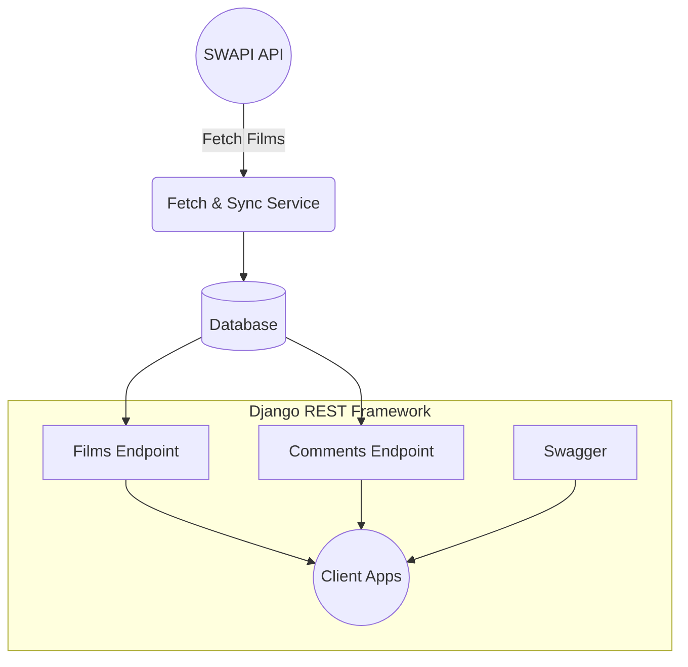
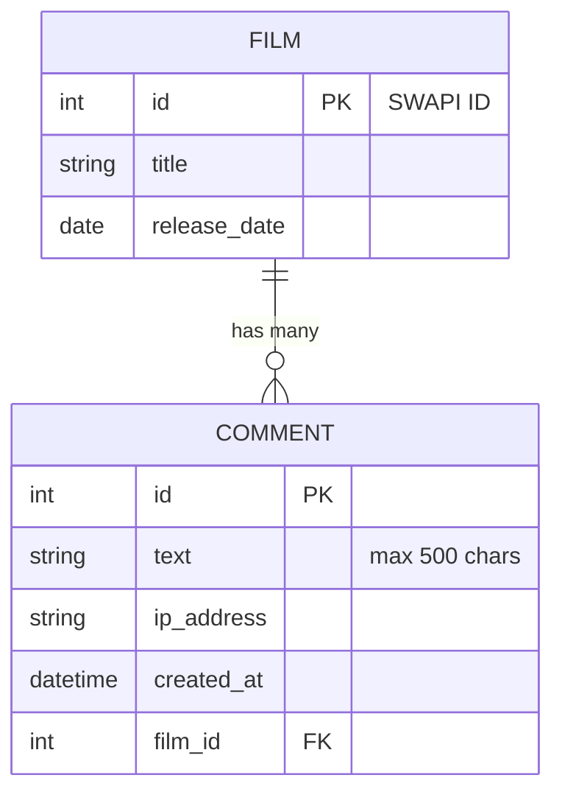
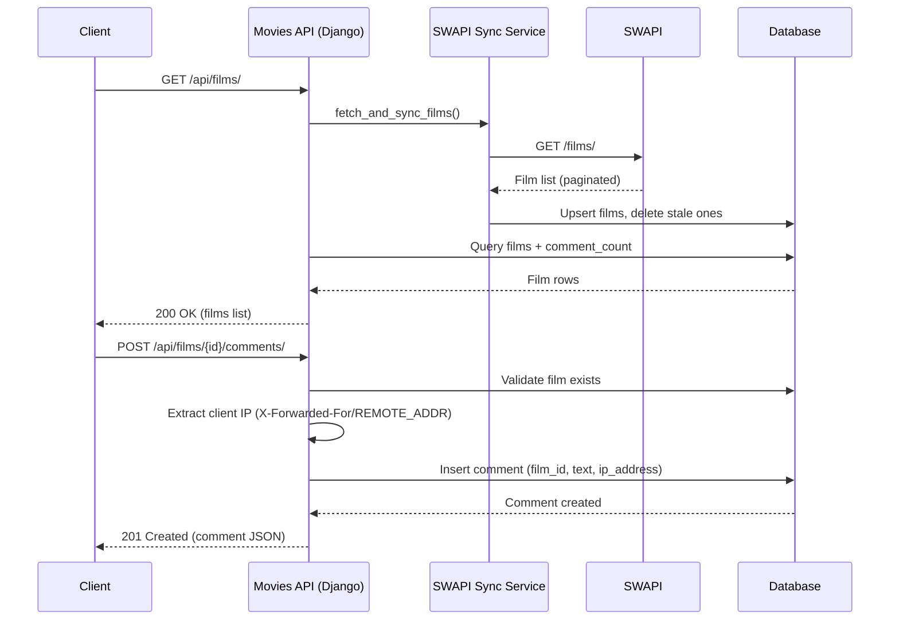

# CODED Movies API — Django DRF + SWAPI Integration

## 🔥 Overview
The **Movies API** is a production-ready Django REST Framework service that synchronizes Star Wars films from **SWAPI** and provides a complete comments system. It includes Swagger UI, automatic data sync, MySQL/SQLite support, CORS/CSRF protection, and PythonAnywhere deployment support.

---

# 📐 Architecture Diagram (Mermaid)



---

# 📚 Features
- Auto-sync films from SWAPI  
- Nested comment endpoints  
- Swagger API documentation  
- Configurable MySQL/SQLite  
- Caching & performance optimization  
- Strong production security defaults  

---

# 🧱 Installation & Setup

## 1. Clone project
```bash
git clone https://github.com/your/repo.git
cd movies_api
```

## 2. Virtual environment
```bash
python -m venv venv
source venv/bin/activate
```

## 3. Install requirements
```bash
pip install -r requirements.txt
```

## 4. Configure environment variables
Create **.env** at project root:

```
DEBUG=True
DJANGO_SECRET_KEY=your-secret-key

SWAPI_BASE_URL=https://swapi.dev/api

MYSQL_DATABASE=Coded$default
MYSQL_USER=Coded
MYSQL_PASSWORD=yourpassword
MYSQL_HOST=Coded.mysql.pythonanywhere-services.com
MYSQL_PORT=3306

SECURE_SSL_REDIRECT=True
```

## 5. Run migrations
```bash
python manage.py migrate
```

## 6. Start server
```bash
python manage.py runserver
```

Visit:
- Films: `http://127.0.0.1:8000/api/films/`
- Swagger: `http://127.0.0.1:8000/api/docs/`

---

# 🛠 API Endpoints

### 🎬 Films
| Method | Endpoint | Description |
|-------|---------|-------------|
| GET | /api/films/ | List films (auto-sync) |
| GET | /api/films/{id}/ | Retrieve film w/ comments |
| GET | /api/films/{id}/comments/ | List comments |
| POST | /api/films/{id}/comments/ | Add comment |

### 💬 Comments
| Method | Endpoint | Description |
|-------|---------|-------------|
| GET | /api/comments/ | List comments |
| POST | /api/comments/ | Create comment |
| DELETE | /api/comments/{id}/ | Remove comment |

---

# 🔧 PythonAnywhere Deployment

## Initial Setup
```bash
git clone https://github.com/<you>/<repo>.git
cd repo
python -m venv .venv
source .venv/bin/activate
pip install -r requirements.txt
python manage.py migrate
python manage.py collectstatic --noinput
```

Then:
1. Configure WSGI  
2. Add environment variables  
3. Reload app  

---

# 🧪 Running Tests
```
pytest
```

---

# 🤝 Contributing
1. Fork  
2. Create feature branch  
3. Submit PR  

---

# 🗃️ Entity Relationship Diagram (ERD)



---

# 🔁 Sequence Flow — Fetch, Cache & Comment


# 📄 Link
🔗 [SWAGGER](https://coded.pythonanywhere.com/api/doc/)
🔗 [Live Deploy](https://coded.pythonanywhere.com/api/)

---

# 📄 License

CODED-SOMETHING

---

## 📬 Contact

**Akindipe Muheez Omogbolahan**  
📧 Email: [akindipemuheez@outlook.com](mailto:akindipemuheez@outlook.com)  
🌐 [Linktree](https://linktr.ee/akinscoded)  
🔗 [LinkedIn](https://www.linkedin.com/in/akinscoded)  
💻 [GitHub](https://github.com/Akins-Coded)
🌐 [Website](https://akinscoded.kit.com/394ddc1ee4)

---

_This project is Built with precision, security, and scalability in mind._
